# Hypervolt Charger Integration Architecture

## Overview

This document describes the architecture of the Hypervolt Charger integration for Home Assistant. The integration provides real-time monitoring and control of Hypervolt EV chargers through their cloud API.

**Key Characteristics:**
- **Integration Type:** Device integration (cloud-based)
- **IoT Class:** Cloud polling with WebSocket push updates
- **Charger Versions Supported:** V2 and V3 hardware
- **Communication:** HTTPS REST API + WebSocket connections
- **Authentication:** OAuth2-style token system (access + refresh tokens)

---

## Quick Start: How It Works

When you add a Hypervolt charger to Home Assistant:

1. You enter your Hypervolt account credentials
2. The integration logs in and discovers your chargers
3. It establishes WebSocket connections to receive real-time updates
4. Home Assistant creates entities (sensors, switches, etc.) to monitor and control the charger
5. WebSockets push state changes immediately while a polling mechanism acts as a safety net

The integration maintains persistent WebSocket connections that automatically reconnect if dropped, and it refreshes authentication tokens before they expire.

---

## Table of Contents

1. [Component Overview](#component-overview)
2. [Setup Process](#setup-process)
3. [Update Process](#update-process)
4. [Component Lifecycle](#component-lifecycle)
5. [Error Handling](#error-handling)
6. [Data Flow Diagrams](#data-flow-diagrams)

---

## Running Tests Locally

This repository includes lightweight unit tests that do not require Home Assistant to be installed.

- Run unit tests: `python3 -m unittest -v`

Or, if you prefer pytest: `python3 -m pip install pytest` then `pytest`

Optional (heavier) Home Assistant-style pytest tests can be added/used via `requirements_test.txt`.

---

## Component Overview

### File Structure

```
hypervolt_charger/
├── __init__.py                          # Integration entry point
├── manifest.json                        # Integration metadata
├── const.py                             # Constants
├── config_flow.py                       # UI configuration flow
├── hypervolt_update_coordinator.py      # Central data coordinator
├── hypervolt_api_client.py              # API client & WebSocket handler
├── hypervolt_device_state.py            # State models and enums
├── hypervolt_entity.py                  # Base entity class
├── led_brightness.py                    # Pure LED brightness mapping helpers (unit-testable without HA)
├── sensor.py                            # Sensor entities
├── switch.py                            # Switch entities
├── number.py                            # Number entities
├── light.py                             # Light entities
├── select.py                            # Select entities
├── button.py                            # Button entities
├── binary_sensor.py                     # Binary sensor entities
├── time.py                              # Time entities
├── text.py                              # Text entities
├── service.py                           # Custom services
├── services.yaml                        # Service definitions
├── strings.json                         # UI strings
└── utils.py                             # Utility functions
```

### Core Components

#### 1. **HypervoltUpdateCoordinator** (`hypervolt_update_coordinator.py`)

The central orchestrator that manages data updates and WebSocket connections.

**Responsibilities:**
- Creates and manages the API client
- Establishes and maintains WebSocket connections
- Coordinates periodic polling (5-minute interval)
- Distributes state updates to all entities
- Manages authentication token refresh
- Handles reconnection logic

**Key Properties:**
- `data: HypervoltDeviceState` - Current charger state
- `api: HypervoltApiClient` - API client instance
- `api_session: aiohttp.ClientSession` - HTTP session
- `notify_on_hypervolt_sync_push_task` - WebSocket task for sync updates
- `notify_on_hypervolt_session_in_progress_push_task` - WebSocket task for session updates (V2 only)

#### 2. **HypervoltApiClient** (`hypervolt_api_client.py`)

Handles all communication with the Hypervolt cloud API.

**Responsibilities:**
- Authentication (login, token refresh)
- REST API calls (schedule management, device discovery)
- WebSocket connection management
- Message parsing and state updates
- Protocol differences between V2 and V3 chargers

**Key Methods:**
- `login()` - Authenticate and get tokens
- `refresh_access_token()` - Refresh the access token
- `notify_on_hypervolt_sync_websocket()` - Main WebSocket connection (all updates)
- `notify_on_hypervolt_session_in_progress_websocket()` - Session-specific WebSocket (V2 only)
- `send_message_to_sync()` - Send commands to the charger

**WebSocket Endpoints:**
- `/ws/charger/{id}/sync` - Primary WebSocket for all state updates
- `/ws/charger/{id}/session/in-progress` - Session updates (V2 chargers only)

#### 3. **HypervoltDeviceState** (`hypervolt_device_state.py`)

Data model representing the complete state of a charger.

**Key State Properties:**
- `is_charging` - Whether currently charging
- `session_id` - Current session ID
- `session_watthours` - Energy delivered in current session
- `max_current_milliamps` - Maximum current limit
- `led_brightness` - LED brightness (0-1)
- `lock_state` - Cable lock state
- `charge_mode` - Charging mode (BOOST, ECO, SUPER_ECO)
- `activation_mode` - How charging starts (PLUG_AND_CHARGE, SCHEDULE, OCTOPUS)
- `schedule_intervals` - Scheduled charging times
- `car_plugged` - Whether a car is connected

**Enumerations:**
- `HypervoltLockState` - UNLOCKED, PENDING_LOCK, LOCKED
- `HypervoltChargeMode` - BOOST, ECO, SUPER_ECO
- `HypervoltActivationMode` - PLUG_AND_CHARGE, SCHEDULE, OCTOPUS
- `HypervoltReleaseState` - DEFAULT, RELEASED

#### 4. **HypervoltEntity** (`hypervolt_entity.py`)

Base class for all Hypervolt entities, extending Home Assistant's `CoordinatorEntity`.

**Features:**
- Provides device information (device registry integration)
- Access to the coordinator
- Common error handling with retry logic

#### 5. **Platform Modules** (e.g., `sensor.py`, `switch.py`)

Each platform module creates specific entity types:

- **Sensors:** Monitor values (energy, current, voltage, power, etc.)
- **Switches:** Control charging on/off
- **Numbers:** Adjust values (LED brightness, max current)
- **Selects:** Choose options (charge mode)
- **Buttons:** Trigger actions (apply schedule)
- **Binary Sensors:** True/false states (car plugged in)
- **Time:** Schedule start/end times
- **Text:** Text input (schedule days)

---

## Setup Process

The setup process happens in phases when you add the integration through the UI.


### Detailed Setup Flow

#### 1. **Config Flow** (`config_flow.py`)

**Step 1: `async_step_user()`**
- Displays login form

**Step 2: `async_step_login(user_input)`**
- Validates credentials
- Calls `login_and_get_charger_ids()`
- Discovers chargers on the account
- If 1 charger: completes setup
- If multiple chargers: shows selection menu

**Step 3: `async_complete_setup(charger_id)`**
- Sets unique ID to prevent duplicates
- Creates config entry with credentials and charger ID

#### 2. **Integration Setup** (`__init__.py`)

**`async_setup(hass, config)`**
- Initializes domain data structure
- Registers custom services (schedule management)
- Returns True

**`async_setup_entry(hass, config_entry)`**
- Extracts credentials from config entry
- Creates `HypervoltUpdateCoordinator`
- Performs first data refresh
- Forwards setup to all platform modules
- On failure: raises `ConfigEntryNotReady` (triggers retry)

#### 3. **Coordinator Creation** (`HypervoltUpdateCoordinator.create_hypervolt_coordinator()`)

```python
coordinator = HypervoltUpdateCoordinator(hass, api)
```

- Creates API client with credentials
- Sets 5-minute polling interval
- Initializes empty device state
- **Does NOT connect yet** - happens on first refresh

#### 4. **First Refresh** (`async_config_entry_first_refresh()`)

This triggers the coordinator's `_async_update_data()` method, which:
1. Checks for existing session (none exists initially)
2. Calls `_update()` which creates the session and WebSockets
3. Returns initial state data

---

## Update Process

The integration uses a **hybrid push/poll model** to keep state synchronized.

### Update Mechanisms

#### 1. **WebSocket Push Updates (Primary)**

Real-time updates are pushed through WebSocket connections:


**V3 Chargers:**
- Single WebSocket: `/ws/charger/{id}/sync`
- Receives all state updates

**V2 Chargers:**
- Primary WebSocket: `/ws/charger/{id}/sync`
- Session WebSocket: `/ws/charger/{id}/session/in-progress`

#### 2. **Polling (Safety Net)**

A 5-minute polling interval ensures data consistency:

```python
SCAN_INTERVAL = timedelta(minutes=5)
```

**When Polling Triggers:**
- Every 5 minutes (if no WebSocket updates received)
- After WebSocket reconnection
- Manual refresh requested

**What Polling Does:**
- **V2 Chargers:** Fetches schedule from REST API
- **V3 Chargers:** No-op if WebSocket active (state already current)
- Checks if access token needs refresh

### Update Flow Diagram


### Message Handling

#### Sync WebSocket Messages

The sync WebSocket uses JSON-RPC 2.0 protocol:

**Incoming Message Types:**

1. **Login Response:**
```json
{"jsonrpc":"2.0","id":"0","result":{"authenticated":true}}
```

2. **State Snapshot:**
```json
{
  "method":"sync.apply",
  "params":[
    {"brightness":0.25},
    {"lock_state":"unlocked"},
    {"max_current":32000},
    {"solar_mode":"boost"}
  ]
}
```

3. **Session Update:**
```json
{
  "method":"get.session",
  "params":{
    "charging":true,
    "session":240,
    "watt_hours":2371,
    "voltage":230
  }
}
```

4. **Schedule Update (V3):**
```json
{
  "method":"schedules.get",
  "params":{
    "applied":{
      "enabled":true,
      "sessions":[
        {"start_time":"23:30","end_time":"05:30","mode":"boost","days":["monday","tuesday"]}
      ]
    }
  }
}
```

**Outgoing Message Types:**

```python
# Login
{"id":"...", "method":"login", "params":{"token":"...", "version":3}}

# Request snapshot
{"id":"...", "method":"sync.snapshot"}

# Set brightness
{"id":"...", "method":"sync.apply", "params":{"brightness":0.5}}

# Start/stop charging
{"id":"...", "method":"sync.apply", "params":{"release":false}}
```

---

## Component Lifecycle

### Startup Sequence


### WebSocket Connection Lifecycle

Each WebSocket connection runs in an asyncio task:

```python
self.notify_on_hypervolt_sync_push_task = asyncio.create_task(
    self.api.notify_on_hypervolt_sync_websocket(...)
)
```

**Connection States:**

1. **Connecting:** Task starts, establishes WebSocket
2. **Authenticating:** Sends login message with access token
3. **Active:** Receiving messages, updating state
4. **Disconnected:** Connection drops (various reasons)
5. **Reconnecting:** Exponential backoff, re-login, reconnect
6. **Cancelled:** Integration unloading

**Reconnection Logic:**

```python
def get_intial_backoff_delay_secs(self):
    return random.randint(3, 12)  # Random 3-12 seconds

def increase_backoff_delay(self, delay_secs: int):
    return min(300, int(delay_secs * 1.7))  # Max 5 minutes
```

- Initial delay: 3-12 seconds (randomized)
- Exponential increase: delay × 1.7
- Maximum delay: 5 minutes
- Resets after 3+ messages received successfully

### Token Refresh Lifecycle

Access tokens expire after 1 hour (3600 seconds):

```python
async def check_for_access_token_expiry(self):
    seconds_to_expiry = (self.api.get_access_token_expiry() - datetime.now(UTC)).total_seconds()
    if seconds_to_expiry < SCAN_INTERVAL.total_seconds() * 1.5:  # < 7.5 minutes
        # Proactively refresh
        await self.api.login()  # Uses refresh token
        # Recreate WebSockets with new token
```

**Token Refresh Triggers:**
- Proactive: When < 7.5 minutes until expiry
- Reactive: After 401 Unauthorized response
- On reconnection: WebSocket drops trigger re-login

### Shutdown/Unload Sequence


**Key Points:**
- `unload_requested` flag signals tasks to exit gracefully
- WebSocket tasks check this flag in message loops
- Tasks are cancelled after closing connections
- HTTP session is closed to free resources

---

## Error Handling

The integration implements multi-layer error handling to maintain reliability.

### Error Types

#### 1. **Authentication Errors**

**`InvalidAuth` Exception:**
- Raised when: 401 responses, invalid credentials, expired refresh token
- Handled by: `ConfigEntryAuthFailed` in coordinator
- Result: User prompted to reconfigure integration

```python
try:
    await api.login(session)
except InvalidAuth as exc:
    raise ConfigEntryAuthFailed() from exc
```

#### 2. **Connection Errors**

**`CannotConnect` Exception:**
- Raised when: Network errors, API unavailable, timeouts
- Handled by: `ConfigEntryNotReady` during setup, retry logic during operation
- Result: Setup retry or continue with cached state

```python
try:
    await coordinator.async_config_entry_first_refresh()
except Exception as exc:
    raise ConfigEntryNotReady from exc
```

#### 3. **WebSocket Disconnections**

**Caught Exceptions:**
- `websockets.ConnectionClosedOK` - Normal closure
- `websockets.ConnectionClosedError` - Abnormal closure
- `websockets.ConnectionClosed` - Generic closure

**Handling:**
```python
try:
    async for message in websocket:
        # Process message
except websockets.ConnectionClosedError:
    _LOGGER.warning("ConnectionClosedError")
    # Continues to reconnection logic
```

**Reconnection:**
- Automatic with exponential backoff
- Re-authenticates on each reconnection attempt
- Continues indefinitely until unload requested

#### 4. **Update Failures**

**During `_async_update_data()`:**

```python
try:
    async with async_timeout.timeout(30):
        return await self._update()
except InvalidAuth as exc:
    raise ConfigEntryAuthFailed() from exc  # Reconfiguration required
except asyncio.TimeoutError as exc:
    raise exc  # Coordinator marks as unavailable
except Exception as exc:
    raise UpdateFailed() from exc  # Temporary failure
```

**Entity Availability:**
- Entities marked unavailable on `UpdateFailed`
- Automatically restored on next successful update
- WebSocket pushes can restore availability without polling

### Error Flow Diagram


### Recovery Strategies

#### 1. **Token Expiry**


#### 2. **Network Interruption**


#### 3. **Partial State Update**

When WebSocket messages contain partial state:

```python
# Only update properties that are present
if "brightness" in item:
    state.led_brightness = item["brightness"]
if "max_current" in item:
    state.max_current_milliamps = item["max_current"]
# Other properties remain unchanged
```

This preserves state consistency when messages don't include all fields.

---

## Data Flow Diagrams

### Overall Architecture

```mermaid
graph TB
    subgraph "Home Assistant"
        UI[UI/Frontend]
        Core[HA Core]
        Entities[Entities<br/>Sensors, Switches, etc.]
        Coord[Update Coordinator]
        API[API Client]
    end

    subgraph "Network"
        HTTP[HTTPS REST API]
        WS1[WebSocket: /sync]
        WS2[WebSocket: /session<br/>V2 only]
    end

    subgraph "Hypervolt Cloud"
        Auth[Auth Service]
        API_Server[API Server]
        WS_Server[WebSocket Server]
        Charger_Backend[Charger Backend]
    end

    UI <-->|Display & Control| Core
    Core <-->|State Updates| Entities
    Entities <-->|Coordinator Pattern| Coord
    Coord <-->|API Calls| API

    API -->|Login/Refresh| HTTP
    API -->|Commands| HTTP
    API -->|Queries| HTTP
    API <-->|Real-time Updates| WS1
    API <-->|Session Updates| WS2

    HTTP --> Auth
    HTTP --> API_Server
    WS1 --> WS_Server
    WS2 --> WS_Server

    Auth --> Charger_Backend
    API_Server --> Charger_Backend
    WS_Server --> Charger_Backend

    Charger_Backend -.->|Physical Connection| Physical_Charger[Physical Charger]
```



### State Update Flow


### Command Flow (User Action)


---

## Key Design Decisions

### 1. **Why Both WebSocket and Polling?**

- **WebSocket:** Fast, efficient, real-time updates
- **Polling:** Ensures consistency if WebSocket fails, required for V2 schedule API
- **Combination:** Best of both worlds - responsive yet reliable

### 2. **Why Store Sent Messages?**

```python
self.websocket_sync_sent_messages = []  # Last 20 messages
```

The sync WebSocket doesn't include method names in responses, only message IDs. Storing sent messages allows mapping responses back to requests for proper handling.

### 3. **Why Separate WebSocket Tasks?**

V2 chargers use two WebSockets:
- `/sync` - Configuration and general state
- `/session/in-progress` - Real-time session data (higher frequency)

V3 chargers consolidated everything into `/sync`.

### 4. **Why Proactive Token Refresh?**

Refreshing 7.5 minutes before expiry prevents:
- Mid-operation authentication failures
- WebSocket disconnections
- User-visible errors

### 5. **Why `session_watthours_total_increasing`?**

Home Assistant's energy dashboard requires `TOTAL_INCREASING` sensors. The raw `session_watthours` resets between sessions, so a derived field tracks the maximum value during a session, resetting only when a new session starts.

---

## Charger Version Differences

### Detection

```python
def get_charger_major_version(self) -> int:
    # Convert charger_id to hex and count bytes
    # 12 bytes = V2
    # 16 bytes = V3
```

### V2 Chargers

- **Schedule API:** REST endpoint (`/charger/by-id/{id}/schedule`)
- **WebSockets:** 2 connections (sync + session-in-progress)
- **Schedule Format:** Simple time intervals
- **Activation Modes:** PLUG_AND_CHARGE, SCHEDULE

### V3 Chargers

- **Schedule API:** Via WebSocket (`schedules.get`, `schedule.set`)
- **WebSockets:** 1 connection (sync only)
- **Schedule Format:** Rich sessions with modes and day-of-week
- **Activation Modes:** PLUG_AND_CHARGE, SCHEDULE, OCTOPUS

### Feature Compatibility Matrix

| Feature | V2 | V3 |
|---------|----|----|
| Basic charging control | ✅ | ✅ |
| Schedule management | ✅ | ✅ |
| Day-of-week schedules | ❌ | ✅ |
| Per-session charge mode | ❌ | ✅ |
| Octopus integration | ❌ | ✅ |
| House power monitoring | ❌ | ✅ |
| Grid power monitoring | ❌ | ✅ |
| Generation power monitoring | ❌ | ✅ |

---

## Custom Services

The integration provides a custom service for advanced schedule management:

### `hypervolt_charger.set_schedule`

Allows external automations (e.g., Octopus Energy Intelligent tracker) to set charging schedules.

**Parameters:**
- `device_id`: Target charger device
- `tracker_rate`: Entity ID of rate tracker (optional)
- `backup_schedule_start`: Fallback start time (optional)
- `backup_schedule_end`: Fallback end time (optional)
- `append_backup`: Whether to append backup to tracker data

**Use Case:**
Integration with smart tariffs that calculate optimal charging windows based on electricity rates.

