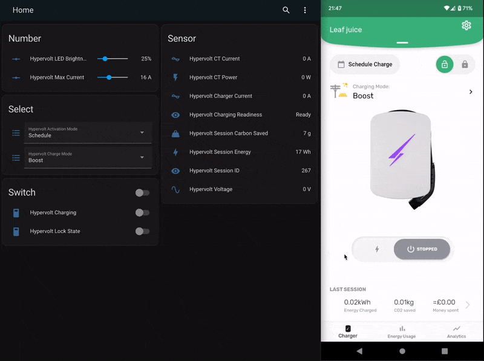

# home-assistant-hypervolt-charger

A [Home Assistant](https://www.home-assistant.io/) Custom Component integration for the [Hypervolt electric vehicle (EV) charger](https://hypervolt.co.uk/). This integration replicates functionality of the Hypervolt mobile app and allows actions to be automated and data to be logged within Home Assistant.

- Start or stop charging based on the cheapest half hour slots available within your agile electricity tariff
- Automatically manage charging when excess solar is available and your home storage battery is full (Super Eco mode alone may not work as you'd like when a home battery is installed)
- Ensure that your charger is configured for the night's charge, every night, no matter what settings were changed during the day e.g. Scheduled Charge mode on, max current set, Boost mode set, ready to charge
- Stop charging when a specific amount of energy has been supplied, or specific state of charge is reached (assuming the EV's state of charge is available via some other integration)
- ...



# Is this official?

This integration is not officially supported by Hypervolt and has been independently developed. Hypervolt are however aware of the integration and appear happy for it to exist.

# Installation

The easy way to set up is to install through [HACS](https://hacs.xyz/). After installation via HACS and reboot of Home-Assistant, this integration can be added through the integration setup UI, like any other integration: Settings / Integrations / Add New Integration.

# Use

Once installed within Home Assistant, and having restarted Home Assistant, you should be able to add the Hypervolt Charger integration. You'll be asked for your Hypervolt account credentials then the integration should find your charger and create a Device with the name of your charger's serial number. The various entities can then be added to dashboards, automations etc. as you wish.

# Synchronisation model

The integration uses the hypervolt.co.uk APIs so is dependent on the cloud. Most of the settings are updated via websocket pushes so changes are reflected to/from the integration near immediately. An exception is the Activation Mode. For this, and as a fallback in case a push message is missed, the integration also polls the Hypervolt APIs every 5 minutes to refresh the state.

# Entities

The integration is intended to match the features of the iOS and Android apps. I've tried to keep the naming similar where possible. The entities exposed are:

## 🎚️ Hypervolt Charging (Switch)

This allows the current charging state to be read and set. It matches the big Charging switch in the app.

ℹ️ There is also the `Hypervolt Charging Readiness` sensor that gives slightly more information about the charge state.

## 🎚️ Hypervolt Lock State (Switch)

Matches the lock feature in the app and allows locking of the charger. The `Lock Pending` state is mapped to `On`

## 🔽 Hypervolt Activation Mode (Select)

Switches between

- `Plug and Charge` and
- `Schedule Charge`

modes.

ℹ️ Changes to this setting are not reflected in realtime within the integration or Hypervolt app. If changed externally to the integration its state should update to the correct state within 5 minutes.

## 🕓 Hypervolt Schedule Session (n) Start/End Time

Represents the schedule start/end time for the given session number. The values are populated from the Hypervolt servers and then can be modifed within Home Assistant.

ℹ️ Session times are not changed until the `Apply Schedule` button is pressed. This allows start and end times to be modified individually and all changes applied at once, to avoid invalid or undesirable schedules being applied while interim changes are being made.

ℹ️ To delete a session, set the start and the end time to be the same value. Once applied, the session will be removed.

## ▶️ Hypervolt Apply Schedule button

Press this button to apply the schedule session start and end times.

Once successfully applied, the session times are read back from the API. This may cause the session time values to update, for example, any gaps in the sessions will be removed i.e. if session 1 and session 3 were populated only, once applied, session 1 and session 2 would be populated. Also any sessions where the start time equals the end time will be removed.

ℹ️ Applying the session times does not automatically switch the Hypervolt into Schedule mode. For that, use the `Activation Mode` select

## 🔽 Hypervolt Charge Mode (Select)

Switches between `Boost`, `Eco` and `Super Eco` modes.

## 🔢 Hypervolt Max Current (Number)

Reads and sets the maximum charging current, in Amps.

## 🔢 Hypervolt LED Brightness (Number)

Reads and sets the LED brightness, in percent, as available via Settings within the app

ℹ️ The LED Mode isn't currently supported by the integration

## 👁 Hypervolt Charging Readiness (Sensor)

One of:

- `Charging`
- `Ready`
- `Not Ready - Force Stopped`

⚠️ `Not Ready - Force Stopped` was added to overcome a gotcha with Hypervolt. If the user manually stops a charge by switching charging off via the app or integration, the Hypervolt charger remembers this state and if later is switched into Schedule Charge activation mode, the scheduled charge _will not automatically start_ as might be expected. To overcome this, the Charging switch needs to be manually toggled. This can be done when in Scheduled mode even outside of the schedule window and will switch the `Hypervolt Charging Readiness` state back to `Ready`. ⚠️ In the Hypervolt app, there doesn't appear to be a way of telling whether the charger is ready or not.

## 👁 EV Power, House Power, Grid Power, Generation Power (Sensors)

Power usage derived from the CT clamp(s), as reported by the Hypervolt app.

ℹ️ This integration just reports the values from the Hypervolt APIs. No assurance of accuracy of the values is given!

## 👁 Hypervolt Voltage, Hypervolt Charger Current (Sensors)

_Only available during a charging session_, these represent the voltage and current from the Hypervolt charger.

ℹ️ This integration just reports the values from the Hypervolt APIs. No assurance of accuracy of the values is given!

⚠️ `Hypervolt Voltage` is not supported by version 3.0 chargers. It always reads as 0 ([issue 18](https://github.com/gndean/home-assistant-hypervolt-charger/issues/18)).

## 👁 Hypervolt CT Current, Hypervolt CT Power (Sensors)

_Only available during a charging session_, these represent the current and power seen by the external CT clamp so will typically measure the household, or at least, whole circuit load, not just the Hypervolt.

ℹ️ This integration just reports the values from the Hypervolt APIs. No assurance of accuracy of the values is given!

## 👁 Hypervolt Session Carbon Saved, Hypervolt Session ID, Hypervolt Session Energy (Sensors)

Are fields related to the current, or most recent charging session.

⚠️ `Hypervolt Session Energy` just reports the session energy exactly from the Hypervolt APIs and resets for each new session. The value may be noisy i.e. decrease slightly during the charging session and will reset each charging session. For this reason, it is not a good choice to use for energy measurement within Home Assistant. For that, use `Hypervolt Session Energy Total Increasing` instead.

## ⚡️ Hypervolt Session Energy Total Increasing (Sensor)

This is a sensor of state class [total_increasing](https://developers.home-assistant.io/blog/2021/08/16/state_class_total/) which means that it is suitable for energy measurement within Home Assistant. Unlike `Hypervolt Session Energy`, the value is not taken directly from the Hypervolt APIs, cannot decrease during a session and will only reset on a new charging session, for which the [total_increasing](https://developers.home-assistant.io/blog/2021/08/16/state_class_total/) logic will handle. For a discussion of why this sensor was created, see [Sensor provides negative value when reset (HA Energy Dashboard) #5](https://github.com/gndean/home-assistant-hypervolt-charger/issues/5)

# Services

## set_schedule

The set_schedule service is intended to be used by 🐙 Octopus Agile users with the [Octopus Energy](https://github.com/BottlecapDave/HomeAssistant-OctopusEnergy) integration, specifically the [Target Rates](https://bottlecapdave.github.io/HomeAssistant-OctopusEnergy/setup/target_rate/) sensors which allow you to find the cheapest periods between two times. This allows an Agile user to set the schedule on the Hypervolt rather than switching the Hypervolt on or off based on the `binary_sensor`. This hopefully avoids failed charges due to cloud or connectivity outages that may occur overnight, and allows the user to check the schedule before settling down for bed 😴. A pseudo-intelligent automation could trigger when the car is plugged in (e.g. from a car integration), set a [dynamic target rate](https://bottlecapdave.github.io/HomeAssistant-OctopusEnergy/services/#octopus_energyupdate_target_config) between the current time until the morning, schedule the Hypervolt for those periods, and send a notification to the phone with the intended charging periods.

It has one target and 4 parameters:

* Target Device - Your Hypervolt ID
* Tracker Rate - The binary_sensor target created by the Octopus Energy integration
* Backup Start - A backup start period if no times are found in the target sensor, consider setting this to give you enough charge to get to work and back...
* Backup End - Backup end period
* Append Backup - If checked this will always append the backup schedule period to the schedule. For example, we could set 06:00-07:00 to allow morning pre-heat climate control to draw from the grid rather than battery

The following sample yaml can be used to configure the service in an automation:

```yaml
service: hypervolt_charger.set_schedule
data:
  backup_schedule_start: "04:30:00"
  backup_schedule_end: "06:00:00"
  tracker_rate: binary_sensor.octopus_energy_target_test
  append_backup: true
target:
  device_id: HYPERVOLT_DEVICE_ID
```

It also has code to support an [intelligent_dispatching](https://bottlecapdave.github.io/HomeAssistant-OctopusEnergy/entities/intelligent/) sensor to schedule the Hypervolt to match the `planned_dispatches` time periods. This has not been tested yet, but could be useful for owners with two cars and two chargers that want to set the second car to match the first car that is on the Intelligent Octopus Go tariff, or potentially Intelligent Octopus Flux or any other Intelligent stuff Octopus comes out with.

# Known limitations

- Tested with version 2.0 and 3.0 Hypervolt home charge points. `Hypervolt Voltage` is not supported on 3.0 charge points.
- Log in has to be via via email address and password. Google or Apple login not supported
- The charger name is not supported. The Device name in Home Assistant will be your charger's serial
- English language only
- LED modes are not supported
- Money spent calculations not supported. In December 2022, Hypervolt added tariff-aware calculations within the app. I will see if we can support this in a future release.
